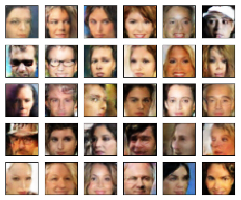

# Face Generator
This project generates new faces using a Deep Convolutional Generative Adversarial Network (DCGAN). 

<div align="center">

</div>

The model succeeds in reaching equilibrium between the generator and the discriminator. After several epochs of training it generates faces which are clearly recognizable.

# Setup

You will need Python 3.5+. 

GPU device is recommended to accelerate training. 

## Install PyTorch 1.1+ and TorchVision

If you are planning to use CUDA (recommended for faster training), run this command:

```
conda install pytorch torchvision cudatoolkit=10.1 -c pytorch
```

If you don't have CUDA, use the following:

```
conda install pytorch torchvision cpuonly -c pytorch
```

## Install Matplotlib

```
conda install matplotlib
```
Matplotlib is used for input data preview, to display generated images and learning curves.


## Install Imageio

```
conda install imageio
```

Imageio is a Python library that provides an easy interface to read and write a wide range of image data.


## Download the Dataset

The network was trained on preprocessed pictures from CelebFaces Attributes Dataset (CelebA). Each of the CelebA images has been cropped to remove parts of the image that don't include a face and subsequently resized to 64x64 resolution.

You can download it by clicking [here](https://s3.amazonaws.com/video.udacity-data.com/topher/2018/November/5be7eb6f_processed-celeba-small/processed-celeba-small.zip).


# Train

To start training a model, specify the number of epochs, the image size, and the path where to store the model artifact:

```
python facegen.py train -epochs=10 -imsize=64 -model=mymodels/model.pth
```

The table below describes various parameters to tune the model and the training process.

Parameter | Meaning | Example
------------ | ------ |-------
imsize | [Required] The size of input and output images. Must be a single value, a power of 2. | -imsize=32
epochs | [Optional] The number of epochs to train for. Default is 2. | -epochs=12
lr | [Optional] The learning rate. Default is 0.0002. | -lr=0.0001
beta1 | [Optional] The exponential decay rate for the first moment estimates. Default is 0.5. | -beta1=0.4
beta2 | [Optional] The exponential decay rate for the second moment estimates. Default is 0.999. | -beta2=0.98
batch | [Optional] The batch size. Default is 64. | -batch=32
zsize | [Optional] The latent vector size. Default is 128. | -zsize=16
d-conv-dim | [Optional] The depth of the first convolutional layer of the discriminator. Default is 64. | -d-conv-dim=128
d-conv-depth | [Optional] The number of convolutional layers of the discriminator. Default is 4. | -d-conv-depth=3
g-conv-dim | [Optional] The depth of the inputs to the *last* transpose convolutional layer of the generator. Default is 64. | -g-conv-dim=128
g-conv-depth | [Optional] The number of convolutional layers of the generator. Default is 4. | -g-conv-depth=5
model | [Optional] The path to a file where the model artifact will be saved. If omitted, defaults to model.pth. | -model mymodel.pth
previn | [Optional] If present, the input data preview will be displayed before training. | -previn
no-samples | [Optional] Disables the preview of images generated while training. | -no-samples
losses | [Optional] Activates plotting of the learning curves. | -losses
gpu | [Optional] Use GPU acceleration for training. Set by default if GPU is available. | -gpu
cpu | [Optional] Instructs not to use GPU acceleration for training. Set by default if no GPU is available. | -cpu


# Generate

In order to generate images with a pretrained model, specify the number of images, the output directory where to place the images, and the path to a file where the trained model is saved:

```
python facegen.py generate -n=10 -output=my/generated/images -model=artifacts/model-33-32.pth

```

The table below describes various parameters allowing to control image generation.

Parameter | Meaning | Example
------------ | ------ |-------
n | [Required] Specifies the number of images to generate. | -n=20
output | [Required] The path to the directory where the generated images have to be stored. | -output generated/images
model | [Optional] The path to the file containing the model artifact. If omitted, defaults to model.pth. | -model=my.pth
ext | [Optional] Allows to specify the generated image format. Defaults to .jpg. | -ext=.png
gpu | [Optional] Use GPU acceleration for generating images. Set by default if GPU is available. | -gpu
cpu | [Optional] Do not use GPU acceleration for generating images. Set by default if no GPU is available. | -cpu
